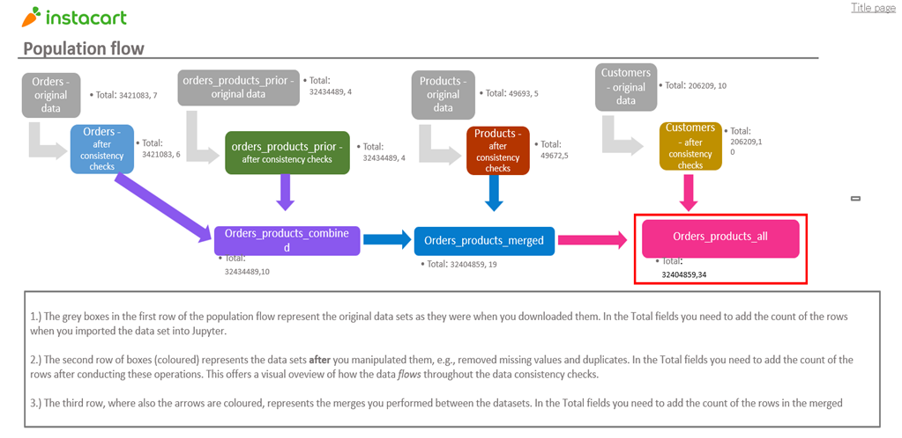

# 🛒 Instacart Grocery Basket Analysis

This project analyzes customer purchasing behavior on Instacart, a leading on-demand grocery delivery platform. Using a real-world dataset provided by Instacart, the goal is to uncover shopping patterns, segment users, and generate actionable insights for marketing and retention strategies.

---

## 📦 Project Objectives

- Clean and prepare a large-scale grocery transaction dataset
- Analyze purchasing habits by hour, day, department, and frequency
- Identify customer segments based on behavioral patterns
- Create clear visualizations to communicate insights
- Deliver stakeholder-friendly outputs

---

## 📁 Repository Structure

| Folder                    | Description                                           |
|---------------------------|-------------------------------------------------------|
| `01_Project_Management`   | Planning, objectives, and client brief                |
| `02_Data`                 | Raw dataset and data dictionary                       |
| `03_Scripts`              | Data cleaning, feature engineering, and analysis scripts |
| `04_Analysis_Visualizations` | Key charts and visualizations                      |
| `05_Sent_to_Client`       | Final deliverables in accessible formats              |

---

## 🧪 Tools & Technologies

- Python (Pandas, NumPy, Seaborn, Matplotlib)
- Jupyter Notebook
- Excel (for client-facing outputs)
- Instacart Dataset (over 3.4 million orders)

---

## 📈 Data Pipeline Overview

The following flowchart illustrates the data processing stages in the Instacart Grocery Basket Analysis project. It shows how raw datasets were cleaned and merged to form enriched tables for analysis.

### 🔍 Stages represented in the diagram:

- **Orders**  
  - Original: 3,421,083 rows  
  - After consistency checks: 3,421,083 rows

- **Orders_products_prior**  
  - Original: 32,434,489 rows  
  - After consistency checks: 32,434,489 rows

- **Products**  
  - Original: 49,693 rows  
  - After consistency checks: 49,672 rows

- **Customers**  
  - Original and validated: 206,209 rows

- **Merged datasets**  
  - `Orders_products_combined`: 32,434,489 rows  
  - `Orders_products_merged`: 32,404,859 rows  
  - `Orders_products_all`: 32,404,859 rows

This visual summary helps communicate the integrity and structure of the data pipeline used throughout the project.

## 📊 Key Insights

- Users tend to shop more during weekend mornings
- Frequent customers show strong product repetition
- Most orders are placed between 10:00 AM and 2:00 PM

---

## 📌 Credits

The dataset used in this project was originally provided by Instacart and distributed through my data analytics training program. It contains over 34 million records, including customer orders, product details, and departmental information. All analysis, cleaning, and insights were performed independently as part of my learning journey.

>This project is for educational purposes only and does not represent Instacart or its business operations.

---

## 📫 Contact

If you're interested in collaborating, improving this analysis, or discussing similar ideas, feel free to reach out via LinkedIn or open an issue in this repository.
